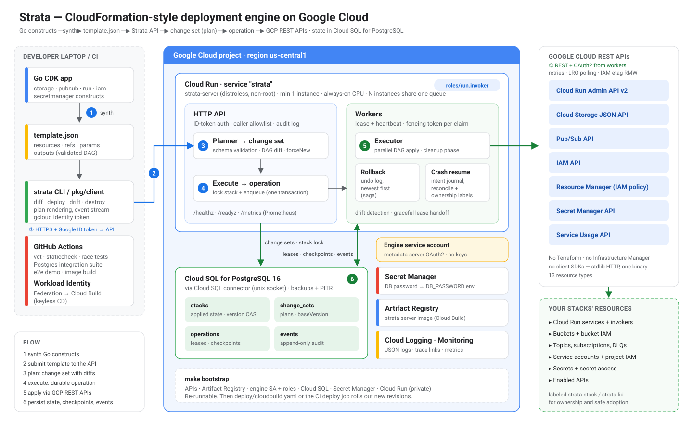

# Strata

**A CloudFormation-style deployment engine for Google Cloud, with a CDK in Go.**
Write infrastructure as Go constructs, synthesize a template, and let a managed control plane plan, apply, roll back and audit it by calling GCP APIs directly. No Terraform, no Infrastructure Manager, no Deployment Manager.



AWS has CDK on top of CloudFormation. Google never shipped either half: no stateful deployment engine to target, and no first-party construct library. Strata is both halves, built as one service.

## Highlights

- **Change sets.** Every deploy is a reviewed plan (`Create` / `Update` / `Replace` / `Delete` / `NoOp` with per-property diffs and "known after apply" values) that can only execute against the stack version it was computed from.
- **Automatic rollback.** Any failed step reverts every completed step in reverse order: created resources are deleted, updates are reverted, replacements are undone. Partially created resources are cleaned up too.
- **Create-before-delete replacement.** Immutable property changes create the new resource first and delete the old one in a cleanup phase after the whole deploy succeeds, exactly like CloudFormation. Generated names (`<stack>-<logicalid>-<random>`) make this collision-free; custom-named resources are protected from impossible replacements at plan time.
- **Crash-safe, resumable operations.** Operations run under database leases with heartbeats. Progress is checkpointed atomically with resource state after every step, and intent is journaled before every cloud call, so a worker killed mid-deploy is resumed by another worker that reconciles in-flight calls (adopting resources that were created but not recorded) instead of duplicating them.
- **Horizontal scale.** Any number of instances share one Postgres; `FOR UPDATE SKIP LOCKED` claims, lease fencing on every write, and immediate lease handoff on graceful shutdown.
- **Dependency-ordered parallelism.** References (`ref`, `getAtt`) and `dependsOn` build a DAG; independent resources deploy concurrently, deletes run dependents-first.
- **Drift detection.** Reads every resource and diffs live state against what was applied.
- **Direct GCP REST providers.** 13 resource types on the standard library alone: ADC/metadata/service-account-key/impersonation auth, retries with jitter, long-running-operation polling, IAM read-modify-write with etag-conflict retries that preserve bindings Strata doesn't own, and handling for eventual consistency of new service accounts.
- **Construct library.** `storage`, `pubsub`, `run`, `iam` and `secretmanager` L2 constructs with secure defaults and intent-based grants (`bucket.GrantReadWrite(api.ServiceAccount())`). APIs are enabled automatically, and Cloud Run services get a dedicated least-privilege identity by default.
- **Production plumbing.** Google ID-token auth (signature-verified, or Cloud Run IAM), caller allowlists, audit logs, Cloud Logging-formatted JSON logs, Prometheus metrics, a distroless non-root image, a one-command GCP bootstrap, Cloud Build and GitHub Actions CD with Workload Identity Federation.

## Quick start (no GCP needed)

```bash
make run     # engine on :8080 with an in-memory store and a fake cloud
make demo    # synthesize the example app, deploy, update, drift-check, destroy
```

`make demo` output (abridged):

```
Change set cs-20261003t103116-33ecbc05 for stack "orders"

  ~ Update   Api   gcp:run:Service   orders-api-mqm2v7
               image: "us-docker.pkg.dev/cloudrun/container/hello" → "gcr.io/demo/orders-api:v2"

Plan: 0 to create, 1 to update, 0 to replace, 0 to delete, 18 unchanged.

10:31:16  UPDATE_IN_PROGRESS     Api (orders-api-mqm2v7)
10:31:16  UPDATE_COMPLETE        Api (orders-api-mqm2v7)
10:31:17  DEPLOY_COMPLETE        orders
✔ DEPLOY succeeded: READY
```

With Postgres (the production store) via Docker: `make compose-up`.

## Define a stack in Go

```go
app := cdk.NewApp()
stack := cdk.NewStack(app, "orders", nil)
env := stack.AddParameter("Env", template.Parameter{Type: "string", Default: "dev"})

uploads := storage.NewBucket(stack, "Uploads", &storage.BucketProps{Versioned: true})
events := pubsub.NewTopic(stack, "OrderEvents", nil)
dbPassword := secretmanager.NewSecret(stack, "DbPassword", nil)

api := run.NewService(stack, "Api", &run.ServiceProps{
    Image:   "gcr.io/my-project/orders-api:v1",
    Env:     map[string]any{"ENV": env, "BUCKET": uploads.BucketName(), "TOPIC": events.TopicName()},
    Secrets: map[string]*secretmanager.Secret{"DB_PASSWORD": dbPassword},
})
uploads.GrantReadWrite(api.ServiceAccount())
events.GrantPublish(api.ServiceAccount())

stack.AddOutput("ApiUrl", api.URL(), "")
app.Synth("strata.out")
```

That synthesizes 13 resources: the service, its own service account, the bucket, topic and secret, three IAM bindings and five API enablements, all wired with references so the engine orders them correctly. See [`examples/orders-platform`](examples/orders-platform) for a fuller app (dead-letter queue, worker identity, parameters, policy-as-code validation) and its [synthesized template](examples/orders-platform/orders.template.json).

## CLI

```bash
strata validate -f strata.out/orders.template.json            # local structural checks + deploy order
strata diff     -s orders -f strata.out/orders.template.json  # plan only (--detailed-exitcode for CI)
strata deploy   -s orders -f strata.out/orders.template.json -p Env=prod   # plan, confirm, apply, stream events
strata describe -s orders                                      # resources, outputs, status
strata events   -s orders --follow
strata drift    -s orders                                      # exit 2 when drifted
strata destroy  -s orders
strata list | types | version
```

`--server` / `STRATA_SERVER` selects the engine. For remote servers the CLI sends `gcloud auth print-identity-token` (override with `STRATA_TOKEN` or `STRATA_TOKEN_COMMAND`). Exit codes: `1` error, `2` changes/drift (when requested), `3` operation failed and was rolled back.

## Deploy the engine to GCP

```bash
PROJECT_ID=my-project REGION=us-central1 \
ALLOWED_CALLERS="user:you@example.com,group:platform@example.com" \
make bootstrap
```

[`deploy/bootstrap.sh`](deploy/bootstrap.sh) enables APIs, creates the Artifact Registry repository, the engine service account and its roles, a Cloud SQL PostgreSQL 16 instance (backups and PITR on, deletion protection), a generated database password in Secret Manager, builds the image and deploys Cloud Run with the Cloud SQL connector, always-on CPU and `--no-allow-unauthenticated`. It is safe to re-run. After that, [`deploy/cloudbuild.yaml`](deploy/cloudbuild.yaml) or the `deploy` job in [CI](.github/workflows/ci.yml) rolls out new revisions.

## Configuration

| Variable | Default | Purpose |
|---|---|---|
| `STRATA_PROJECT` / `STRATA_REGION` | metadata / `us-central1` | Target project and default region |
| `STRATA_MODE` | `all` | `api`, `worker` or both in one process |
| `STRATA_STORE` | `postgres` | `postgres` or `memory` |
| `DATABASE_URL` or `DB_HOST`, `DB_NAME`, `DB_USER`, `DB_PASSWORD`, `DB_SSLMODE` | | Postgres connection; `DB_HOST=/cloudsql/<connection>` for the Cloud SQL socket |
| `STRATA_PROVIDER` | `gcp` | `gcp` or `fake` |
| `STRATA_AUTH` | `google` | `google` (verify ID tokens), `cloudrun-iam` (trust Cloud Run IAM), `none` |
| `STRATA_AUTH_AUDIENCES` | | Accepted `aud` values in `google` mode (service URL; add `32555940559.apps.googleusercontent.com` for gcloud user tokens) |
| `STRATA_ALLOWED_CALLERS` | | Allowlist: emails and `domain:example.com` |
| `STRATA_DENY_PUBLIC_MEMBERS` | `false` | Reject `allUsers`/`allAuthenticatedUsers` bindings at plan time |
| `STRATA_WORKER_CONCURRENCY` | `4` | Operations per process |
| `STRATA_RESOURCE_CONCURRENCY` | `8` | Parallel resource actions per operation |
| `STRATA_LEASE` | `60s` | Operation lease; renewed every lease/3 |
| `STRATA_ACTION_TIMEOUT` | `30m` | Per provider call, including LRO polling |
| `STRATA_LOG_LEVEL` / `STRATA_LOG_FORMAT` | `info` / `json` | Logging |

Credentials follow Application Default Credentials: `STRATA_GCP_ACCESS_TOKEN`, `GOOGLE_APPLICATION_CREDENTIALS` (service account, authorized user, impersonated), gcloud ADC, then the metadata server.

## How it works

See [docs/architecture.md](docs/architecture.md) for the design, [docs/templates.md](docs/templates.md) for the template format, [docs/resource-types.md](docs/resource-types.md) for every resource type (generated from the code), and [docs/operations.md](docs/operations.md) for the runbook.

```
cmd/strata-server     API + workers                 internal/engine      planner, executor, rollback, cleanup, drift
cmd/strata            CLI                           internal/provider    provider contract, registry, schemas
pkg/cdk               construct library (L1)        internal/provider/gcp  REST providers, auth, LRO, IAM
pkg/cdk/gcp/...       L2 constructs                 internal/provider/fake in-memory cloud with fault injection
pkg/template          template format, intrinsics   internal/store       postgres + memory (shared conformance suite)
pkg/client            Go API client                 internal/api, worker, auth, obs, config
```

## Testing

```bash
make test               # unit + integration tests with the race detector
make test-integration   # adds the Postgres store suite (STRATA_TEST_DATABASE_URL)
make lint               # gofmt, go vet, staticcheck
```

Coverage includes plan/diff semantics, rollback of updates/creates/replacements, cleanup ordering, crash reconciliation (simulated worker death after a cloud call lands but before it is recorded), lease expiry and fencing, the same conformance suite against the in-memory and Postgres stores, every GCP provider against a scripted Google API (retries, error mapping, LRO failure, IAM etag conflicts, bucket force-destroy paging), ID-token verification, and an HTTP end-to-end lifecycle. The example app is synthesized and deployed through the real engine in tests, so the construct library and provider schemas cannot drift apart.

The GCP providers are verified against their REST contracts with fakes. Before relying on a new resource type in production, run the example once in a sandbox project.

## Limitations and roadmap

- 13 resource types today (Cloud Run, Cloud Storage, Pub/Sub, IAM, Secret Manager, Service Usage). Next: Cloud SQL, VPC, Artifact Registry, GKE, generated L1 providers from Google's API discovery documents.
- IAM is managed per member (non-authoritative); there is no authoritative policy resource.
- No cross-stack references or nested stacks yet; stack outputs are readable via the API.
- Secret values are intentionally out of band; only secret containers and access are declared.

## Repository

**Description:** CloudFormation-style deployment engine for Google Cloud with a CDK in Go. Change sets, automatic rollback, crash-safe resumable operations and drift detection over direct GCP REST APIs, without Terraform.

**Topics:** `gcp` `google-cloud` `infrastructure-as-code` `iac` `cdk` `cloudformation` `deployment-engine` `golang` `cloud-run` `control-plane` `platform-engineering` `devops` `postgresql` `distributed-systems`

## Skills demonstrated

- **Distributed systems:** lease-based work distribution, heartbeats and fencing tokens, optimistic concurrency (CAS versions), atomic checkpointing, idempotent and resumable state machines, write-ahead intent journaling and crash reconciliation.
- **Control-plane design:** declarative desired-state reconciliation, DAG planning and parallel execution, create-before-delete replacement, compensating-action rollback (saga), drift detection.
- **Google Cloud:** Cloud Run v2, Cloud Storage, Pub/Sub, IAM policy semantics (etags, conditional bindings, propagation delay), Secret Manager, Service Usage, long-running operations, ADC and OAuth2 flows (JWT bearer, refresh token, impersonation, metadata server), Cloud SQL connector, Workload Identity Federation.
- **Go:** standard-library-first design (one dependency), `net/http` routing, `log/slog`, context cancellation, the race detector, table-driven and conformance testing, `httptest`-based API fakes.
- **API and developer experience:** a typed construct library with secure defaults and intent-based grants, a CLI with plan rendering and event streaming, a public Go client.
- **Security:** RS256 ID-token verification with JWKS caching, caller allowlists, least-privilege identities, no secrets in templates or state, distroless non-root containers, keyless CI/CD.
- **Operations:** Prometheus metrics, Cloud Logging structured logs, audit events, graceful shutdown with lease handoff, PostgreSQL migrations, Cloud Build and GitHub Actions pipelines.

## License

[MIT](LICENSE)
