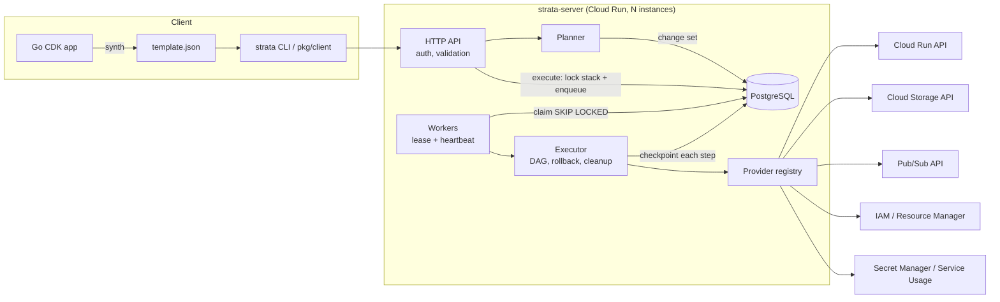

# Architecture

Strata is the GCP equivalent of the CloudFormation service plus the AWS CDK: a stateful deployment engine that owns ordering, state and rollback, and a construct library that compiles Go code to the engine's template format.

## Lifecycle of a deploy

1. **Synth.** Constructs build a tree; every L1 resource gets a stable logical ID derived from its path. References between constructs become intrinsics (`ref`, `getAtt`, `param`, `join`). The template is validated (identifiers, references, cycles, custom policy hooks) before it is written.
2. **Plan (change set).** The API validates the template structurally and against provider schemas (unknown or missing properties, literal types, `getAtt` attribute names, server policy). The planner walks the dependency DAG in topological order, resolving each resource's properties against current state. References to resources being created or replaced resolve to *unknown*, which cascades: a dependent whose immutable property depends on a replaced resource is itself replaced. Each property diff is classified as in-place or `forceNew`. The change set records the stack version it was computed from.
3. **Execute.** The API locks the stack and enqueues an operation in one transaction (`StartOperation`). A stale change set (stack version moved) or a busy stack returns 409.
4. **Apply phase.** A worker claims the operation and runs ready resources concurrently (all dependencies done, bounded by `STRATA_RESOURCE_CONCURRENCY`). For each step: journal the intent (including the generated physical name) → call the provider → atomically save resource state + checkpoint + an undo entry. The first failure stops new work, lets in-flight steps finish, and switches to rollback.
5. **Rollback phase** (on failure). Undo entries are applied newest-first: delete created resources, revert updates to their previous properties, delete replacements and reinstate the originals. Failed creates leave an undo entry too, so partially created resources (e.g. a Cloud Run service whose revision failed) are removed. The stack returns to its previous template, parameters and outputs (`ROLLBACK_COMPLETE`). If an undo step fails, the stack is `ROLLBACK_FAILED` and the leftover is queued for cleanup; the next deploy retries it.
6. **Cleanup phase** (on success). Replaced originals and resources removed from the template are deleted dependents-first (ordered by the previous template's graph), honoring `deletionPolicy: Retain`. Cleanup failures never fail a successful deploy; they stay in `pendingCleanup` and are retried next time.
7. **Finalize.** Outputs are resolved, the stack becomes `READY`, the lock is released.

## Durability and concurrency

| Concern | Mechanism |
|---|---|
| Two deploys to one stack | `currentOperation` lock + version CAS in `StartOperation` |
| Stale plans | change set pinned to `baseVersion` |
| Many workers | `UPDATE … WHERE id = (SELECT … FOR UPDATE SKIP LOCKED)` claim with a lease |
| Zombie workers | each claim gets a unique lease token (`<worker>/<attempt>`) checked on every write and renewal (fencing); a worker that lost its lease, or cannot renew for most of a lease period, cancels its run |
| Worker crash | lease expires → another worker resumes from the checkpoint |
| Crash between cloud call and record | journal before the call; on resume `Read` the journaled physical ID: if it exists, adopt and converge it; otherwise retry |
| Re-running a create after a lost response | deterministic, journaled names + `ErrAlreadyExists` adoption gated on ownership labels (`strata-stack`, `strata-lid`) |
| Name collisions with resources Strata doesn't own | custom names are checked before creating; a collision fails the step without an undo entry, so rollback can never delete or adopt a foreign resource |
| Graceful shutdown | in-flight steps finish, progress is saved, the lease is handed back immediately |
| Partial DB writes | resource state and checkpoint are saved in one transaction (`SaveProgress`) |
| Clock skew | lease expiry uses the database clock |

## Provider contract

Every resource type implements `Schema / Create / Read / Update / Delete`. Handlers run to completion, polling long-running operations internally, and wrap `ErrNotFound` / `ErrAlreadyExists` so the engine can make decisions. The schema declares property types, defaults, required and `forceNew` flags, attributes, the name property and name length limits, and whether the type supports labels. That is all the engine needs to plan, generate names and inject ownership labels; providers know nothing about stacks, ordering or rollback.

`Read` also returns *observed* input properties, which drift detection compares with applied state.

## Why direct REST instead of client SDKs

One dependency (`lib/pq`), a ~10 MB static binary, uniform retry, error and LRO handling across every API, and full control over request shapes (for example IAM policy round-tripping that preserves conditional bindings). The provider layer is designed so L1 providers can later be generated from Google's API discovery documents.

## Security model

- Callers authenticate with Google ID tokens: verified in-process (`google` mode, RS256 + JWKS + issuer/audience/expiry) or by Cloud Run IAM at the edge (`cloudrun-iam` mode). An allowlist narrows who may call.
- The engine runs as a dedicated service account. Its project roles bound the blast radius of any template.
- Templates and state never contain secret values; Secret Manager versions are added out of band and mounted by reference.
- `STRATA_DENY_PUBLIC_MEMBERS` and synth-time `AddValidation` hooks provide policy guardrails.
- Every API mutation emits an audit log line with the caller; every resource transition is an event.
